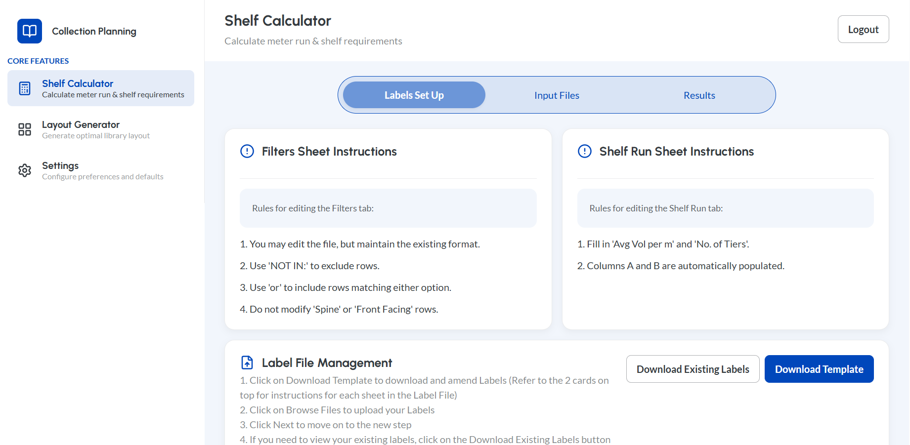
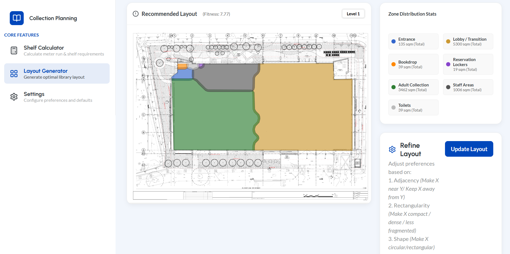

# LibraryPlan
<div align="center">
  <h4><a href="https://drive.google.com/file/d/1MY3Dv_yCJnw4hx2RMO7_VJYvsrCRWo_i/view?usp=sharing">Project Demo</a> | <a href="https://drive.google.com/file/d/1MY3Dv_yCJnw4hx2RMO7_VJYvsrCRWo_i/view?usp=sharing">Paper</a></h4>
</div>  

In collaboration with SUTD and NLB, **LibraryPlan** is a web application designed to assist and bridge the gap between librarians and architects. It combines data analytics for collection management with genetic algorithm for spatial layout optimization.

## Features

### 1\. Shelf Calculator
   

  * **Data-Driven Planning:** Ingests circulation and collection data (Excel/CSV).  
  * **Smart Calculation:** Computes shelf runs based on inputs (eg. target and current collection sizes).  
  * **Automated Reporting:** Generates formatted Word (`.docx`) reports detailing shelf runs and tier requirements.  

### 2\. Layout Generator
    

  * **Genetic Algorithm Optimization:** Uses the DEAP library to generate optimal floor plan layouts based on adjacency rules, flow constraints, and zone targets.
  * **Multi-Floor Support:** Capable of optimizing layouts across multiple library levels.
  * **Interactive Tracer:** Built-in tool to trace boundaries and fixed elements (entrances, lifts) directly on uploaded floor plan images.
  * **Visual Analytics:** Provides zone distribution statistics and downloadable PDF reports of the generated layouts.

## Tech Stack

### Frontend

  * **Framework:** React 19 (via Vite)
  * **Routing:** React Router v7
  * **Styling:** CSS Modules, Lucide React (Icons)
  * **Utilities:** `xlsx` (Excel parsing), `jspdf` & `html2canvas` (PDF generation)

### Backend

  * **API:** Python FastAPI
  * **Algorithm:** DEAP (Distributed Evolutionary Algorithms in Python), NumPy, SciPy
  * **AI Model:** Google Gemini
  * **Geometry:** Shapely
  * **Data Processing:** Pandas, OpenPyXL, Python-docx
  * **Database:** SQLite (via SQLAlchemy)

-----

## Prerequisites

Before running the project, ensure you have the following installed:

  * **[git](https://git-scm.com/install/)**
  * **[Node.js](https://nodejs.org/en/download)** (v18 or higher) & **npm**
  * **[Python](https://www.python.org/downloads/)** (v3.12 or higher)
  * **[Visual Studio Code (VSC)](https://code.visualstudio.com/docs/setup/setup-overview)** or any other coding interface

-----

## Quick Start Guide

The project is split into two parts: the `frontend` (React) and the `backend` (Python). **You need to run two separate terminals simultaneously.**

### 1\. Backend Setup (FastAPI)
1. Git clone
 ```bash
    git clone https://github.com/Spatial-DS/frontend.git
    cd frontend
```

### 2\. Backend Setup (FastAPI)

1.  Open a terminal and navigate to the backend directory:

    ```bash
    cd backend
    ```

2.  Create and activate a virtual environment:

    ```bash
    # Windows
    python -m venv venv
    venv\Scripts\activate

    # Mac/Linux
    python3 -m venv venv
    source venv/bin/activate
    ```

3.  Install Python dependencies:

    ```bash
    pip install -r requirements.txt
    ```

4. Set up LLM API Key: The application requires a Google Gemini API key for the AI layout rules features.
    The key will be provided in a separate file (GOOGLE_API_KEY). Open the file in Notepad and paste the key in.

    ```bash 
    # Windows (inside virtual environment)
    $env:GOOGLE_API_KEY="your_api_key_here"

    # Mac/Linux
    export GOOGLE_API_KEY=your_api_key_here
    ```

5. Start the backend server:

    ```bash
    python app.py
    ```

    *The server will start at `http://localhost:8000`.*

### 3\. Frontend Setup (React)

1.  Open a **new** terminal window and navigate to the frontend directory:

    ```bash
      # Project Root directory
      ./frontend
    ```

2.  Install Node dependencies:

    ```bash
    npm install
    ```

3.  Start the development server:

    ```bash
    npm run dev
    ```

    *The application will likely run at `http://localhost:5173` (check terminal output).*

-----

## 🔐 Access & Usage

1.  Open your browser and navigate to the frontend URL (e.g., `http://localhost:5173`).
2.  **Login:** You will be greeted by a Sign-In page. Use the default administrative credentials found in the source code:
      * **Username:** `tampines`
      * **Password:** `tampineslibrary`
        *(Note: You can create new users via the "Sign Up" link on the login page, which saves locally to your browser).*

### Workflow 1: Shelf Calculator

1.  Navigate to **Labels Set Up** to download the template or upload existing labels.
2.  Go to **Input Files** to define Target/Current collection sizes.
3.  Upload your **Raw Data** (from QlikSense/ILS) and **Collection Mix** files.
4.  Click **Calculate** to receive a `.docx` report.

### Workflow 2: Layout Generator

1.  Go to **Input Files** and set the Total GFA (Gross Floor Area).
2.  Select the desired zones (Adult Collection, Children's Area, etc.) and their size constraints (sqm or %).
3.  Upload a floor plan image and use the **Tracer Tool** to define the boundary, entrances, and fixed obstacles.
4.  Click **Generate Layout**. The AI will run through generations to find the optimal arrangement.
5.  View results in the **Results** tab and download a PDF summary.

-----

## 📂 Project Structure

```text
spatial-ds/frontend/frontend-cells/
├── src/                        # React Frontend Source
│   ├── Components/             # UI Components (Cards, Buttons, Tracer, etc.)
│   ├── Pages/                  # Main Page Views (LayoutGenerator, ShelfCalculator)
│   └── App.jsx                 # Main Router
├── backend/                    # Python Backend
│   ├── floorplan/              # Core Logic
│   │   ├── ga.py               # Genetic Algorithm Engine
│   │   ├── geometry.py         # Shapely Geometry Processing
│   │   ├── api.py              # Optimization Orchestrator
│   │   └── rules.csv           # Adjacency Rules Matrix
│   ├── generated_reports/      # Output folder for Word docs
│   ├── app.py                  # FastAPI Entry Point
│   └── requirements.txt        # Python Dependencies
├── package.json                # Frontend Dependencies
└── vite.config.js              # Vite Configuration
```

## 🐛 Troubleshooting

  * **Backend Error:** If you see `ModuleNotFoundError`, ensure you have activated your virtual environment and installed `requirements.txt`.
  * **API Key Error:** If the optimization fails immediately, ensure `GOOGLE_API_KEY` is set correctly in the backend terminal.
  * **Optimization Stalls:** The Layout Generator is computationally intensive. Check the terminal running the backend for progress logs.
  * **Database Locks:** The app uses a local SQLite file (`floorplan.db`). If the app crashes, delete this file to reset the database state; it will be recreated automatically on the next run.
